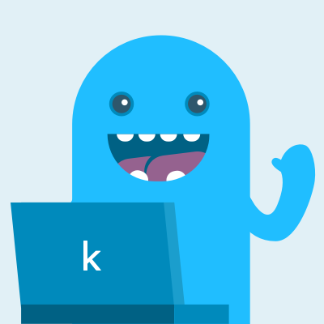
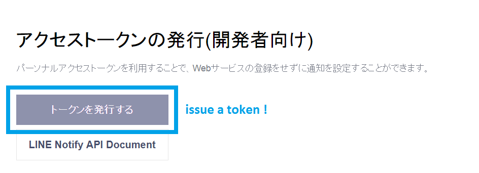

# line_kernel_notifier

<b> How to use </b>

<b>step 1.</b>  
Create a new API token of Kaggle and place a downloaded kaggle.json file to the location has been writen in the following instruction.  
https://github.com/Kaggle/kaggle-api#api-credentials  
`~/.kaggle/kaggle.json (on Windows in the location C:\Users\<Windows-username>\.kaggle\kaggle.json - you can check the exact location, sans drive, with echo %HOMEPATH%)`

<b>step 2.</b>  
Register and log in LINE Notify.  
https://notify-bot.line.me/my/

<b>step 3.</b>  
Issue an access token of LINE Notify.  

<b>step 4.</b>  
Invite line notify account to your talk room (where you will receive notifications).  

<b>step 5.</b>  
Add your token to the following line in `line_kernel_notify.py`.  
https://github.com/Greenwind1/line_kernel_notifier/blob/484c715e2827e07dc3173491d7b64179de900d62/line_kernel_notify.py#L28  
And just run `line_kernel_notify.py` with following command.  
    `> python line_kernel_notify.py`  
    Ofcourse you can pass sys.argv after modifying `line_kernel_notify.py`.  
    e.g. line notify token, competition name..  

<b>step 6.</b>  
Happy Kaggling !  

---

<b>Reference</b>

1. u++ blog
https://upura.hatenablog.com/entry/kaggle-notification

2. u++ github
https://github.com/upura/kaggle-notification-pub

